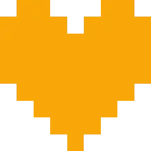

<aside markdown class="infobox">
  
Bravery

  <figure>
    
    <figcaption>The soul of Bravery</figcaption>
  </figure>
  
Attributes

  <table class="invisible">
    <tr>
      <td><strong>User</strong></td>
      <td>Third fallen child</td>
    </tr>
    <tr>
      <td><strong>Source</strong></td>
      <td>
        <a href="../mechanics/introduction.md">Survey Program</a> 
        <a href="../mechanics/fountains.md">Dark Fountains</a>
      </td>
    </tr>
    <tr>
      <td><strong>Weak To</strong></td>
      <td>{{ element("wind") }}</td>
    </tr>
    <tr>
      <td><strong>Rarity</strong></td>
      <td>{{ rarity("uc", 8, "power") }}</td>
    </tr>
  </table>
</aside>

# Bravery

## Overview

---

## Abilities

## Soul Techniques

## Trivia

-

## Changelog

| Release Date | Version                        | Changes       |
| ------------ | ------------------------------ | ------------- |
| TBA.         | [v1.0.0](../updates/v1-0-0.md) | Added Bravery |

---

_Last updated: [v1.0.0](../updates/v1-0-0.md)_
